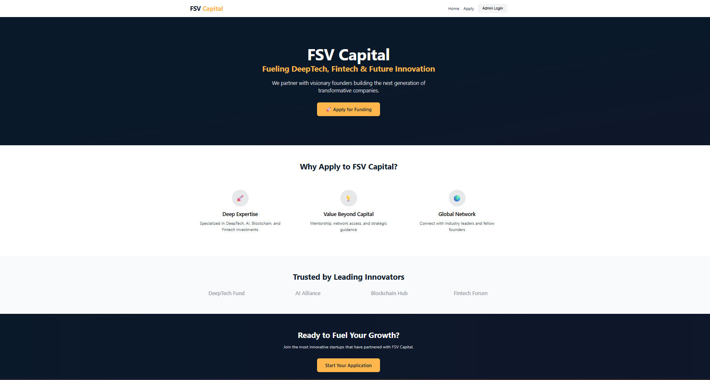
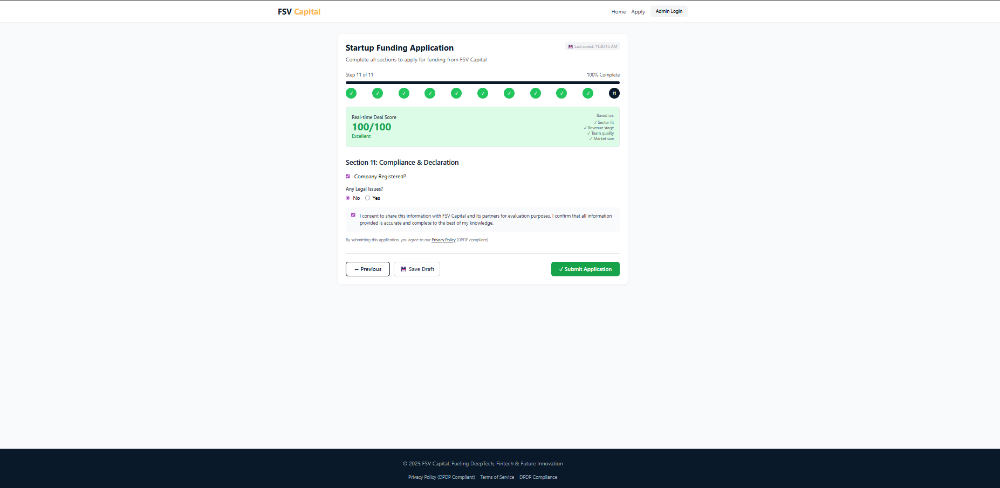
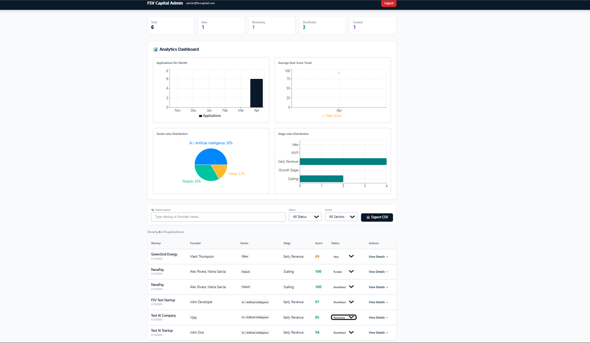
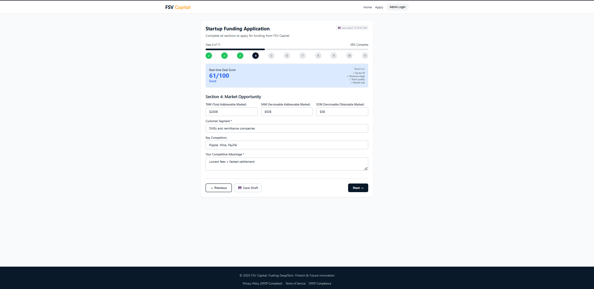
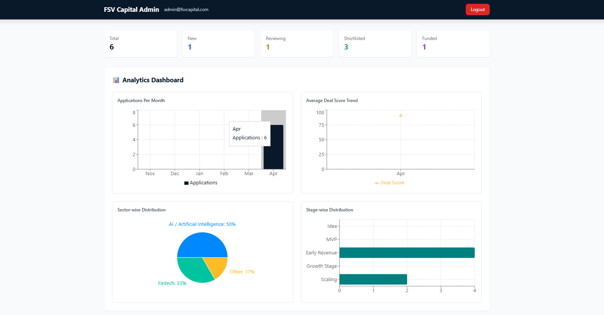

<div align="center">
  
  
  
  
  
</div>

<br>

<div align="center">
  <h1>🚀 FSV CAPITAL</h1>
  <h2>Startup Funding Application Platform</h2>
  <p><i>Fueling DeepTech, Fintech & Future Innovation</i></p>
</div>

---

## 📸 Quick Preview

| | | |
|:---:|:---:|:---:|
|  |  |  |
| *Landing Page* | *11-Step Application Form* | *Admin Dashboard* |

| | |
|:---:|:---:|
|  |  |
| *Real-Time Deal Score* | *Analytics Dashboard* |

---

## 🎯 About The Project

**FSV Capital** is a premium, investor-grade web platform that enables startups to apply for funding and allows FSV Capital to manage their deal pipeline efficiently.

> *"This is not just a form. It's a complete Deal Intake + Screening + Pipeline Management Platform."*

### 📸 Screenshots Gallery
- 📸 **Complete Screenshots:** [View on Google Drive](https://drive.google.com/drive/folders/1-QciyBpmF7eHslKgU37Hz3ih6TIlcCRx?usp=sharing)

---

## ✨ Key Features

### 👨‍💻 For Founders
| Feature | Description |
|---------|-------------|
| 📝 **11-Section Form** | Complete application covering all aspects of your startup |
| 📊 **Progress Bar** | Visual tracking of form completion |
| 💾 **Save & Resume** | Never lose progress with localStorage draft |
| 🎯 **Real-Time Deal Score** | Instant 0-100 score based on your inputs |
| 📎 **PDF Upload** | Secure pitch deck upload (mandatory) |
| ✅ **Auto-Validation** | Email, phone, URL, and field validation |
| 📱 **Responsive Design** | Works perfectly on mobile & desktop |
| 📧 **Email Confirmation** | Instant acknowledgment of submission |

### 🔐 For Admin (FSV Capital Team)
| Feature | Description |
|---------|-------------|
| 📊 **Analytics Dashboard** | 4 interactive charts (monthly trends, scores, sectors, stages) |
| 🔍 **Instant Search** | Real-time filtering by startup/founder name |
| 🏷️ **Status Management** | New → Reviewing → Shortlisted → Rejected → Funded |
| 📝 **Internal Notes** | Add private comments on applications |
| 📥 **Export to CSV** | One-click export for external analysis |
| 📧 **Email Alerts** | Instant notification on new applications |
| 📄 **Full Application View** | Complete details of every submission |

---

## 🛠️ Tech Stack

### Frontend
- **React 18** + **Vite** — Fast and modern frontend setup  
- **Tailwind CSS** — Custom premium UI styling  
- **Recharts** — Interactive data visualization & analytics  
- **Axios** — Seamless API integration  

### ⚙️ Backend
- **Node.js** + **Express.js** — Server-side application & API handling  
- **MongoDB Atlas** — Cloud-based database management  
- **JWT Authentication** — Secure user authentication  
- **Multer** — File upload handling  
- **Nodemailer** — Email service integration  

### 🧰 Development Tools
- **VS Code** — Code editor  
- **Git & GitHub** — Version control and collaboration  
- **Postman** — API testing  

---

## 🏗️ Architecture


---

## 📊 Deal Score Calculation (0-100)

| Parameter | Weight | Max Score |
|-----------|--------|-----------|
| 🎯 Sector Fit (AI/Fintech/Blockchain/DeepTech) | 15% | 15 |
| 📈 Revenue Stage (Scaling → Growth → Revenue → MVP → Idea) | 20% | 20 |
| 🚀 Growth Rate (50%+ → 30%+ → 20%+ → 10%+ → >0%) | 15% | 15 |
| 👥 Team Quality (IIT/Stanford/Ex-Google/Previous Startup) | 15% | 15 |
| 🌍 Market Size (TAM: Billion+ → Million+ → Crore+) | 10% | 10 |
| 💡 Innovation (Patents → Strong USP → Basic USP) | 10% | 10 |
| 📎 Pitch Deck Uploaded | 5% | 5 |
| 📋 Completeness (All sections filled) | 10% | 10 |
| **TOTAL** | **100%** | **100** |

---

## 🚀 Installation Guide

### Prerequisites
- Node.js (v18 or higher)
- MongoDB Atlas account (or local MongoDB)
- Gmail account (for email notifications)

### Step 1: Clone Repository
```bash
git clone https://github.com/yourusername/fsv-capital-platform.git
cd fsv-capital-platform
```

### 🚀 Step 2: Backend Setup

```bash
cd backend
npm install
```

### 🔐 Environment Variables

Create a `.env` file in the backend folder and add the following:

```env
PORT=5000
MONGO_URI=your_mongodb_connection_string
JWT_SECRET=your_super_secret_key
ADMIN_EMAIL=admin@fsvcapital.com
ADMIN_PASSWORD=FSV@Admin2025
EMAIL_USER=your_gmail@gmail.com
EMAIL_PASS=your_16_digit_app_password
FRONTEND_URL=http://localhost:5173
```

### ▶️ Start Backend

```bash
npm run dev
```

### 💻 Step 3: Frontend Setup

```bash
cd frontend
npm install
npm run dev
```
### 🌐 Step 4: Access Application

| Page              | URL                          |
|------------------|------------------------------|
| Landing Page     | http://localhost:5173        |
| Application Form | http://localhost:5173/apply  |
| Admin Login      | http://localhost:5173/admin/login |

### 🔑 Admin Credentials

```text
Email: admin@fsvcapital.com
Password: FSV@Admin2025
```

### 📧 Email Configuration (Gmail Setup)

To enable email notifications:

1. Enable **2-Step Verification** on your Gmail account  

2. Generate **App Password**:
   - Go to: Google Account → Security → App Passwords  
   - Select: **Mail** + **Windows Computer**  
   - Copy the 16-digit code  

3. Update `.env` file:

```env
EMAIL_USER=your_gmail@gmail.com
EMAIL_PASS=abcd efgh ijkl mnop
```
### 📁 Project Structure

```
fsv-capital-platform/
│
├── backend/
│   ├── server/
│   │   ├── config/         # DB & Email config
│   │   ├── controllers/    # Business logic
│   │   ├── middleware/     # Auth & Error handlers
│   │   ├── models/         # MongoDB schemas
│   │   ├── routes/         # API endpoints
│   │   ├── services/       # Email service
│   │   ├── utils/          # Deal score calculator
│   │   └── uploads/        # Stored files
│   └── package.json
│
├── frontend/
│   ├── src/
│   │   ├── components/     # Reusable UI components
│   │   ├── pages/          # Main pages (Form, Admin, etc.)
│   │   ├── services/       # API calls
│   │   ├── utils/          # Validation & constants
│   │   └── styles/         # Tailwind CSS
│   └── package.json
│
├── screenshots/            # GitHub preview images
├── README.md
└── .gitignore
```

### 🔄 API Endpoints

| Method | Endpoint                             | Description                          |
|--------|--------------------------------------|--------------------------------------|
| POST   | /api/applications/submit             | Submit new application               |
| GET    | /api/admin/applications              | Get all applications (admin)         |
| POST   | /api/admin/login                     | Admin login                          |
| PUT    | /api/admin/applications/:id/status   | Update application status            |
| PUT    | /api/admin/applications/:id/notes    | Update admin notes                   |
| GET    | /api/admin/stats                     | Get dashboard statistics             |
| GET    | /api/admin/chart-data                | Get analytics chart data             |
| GET    | /api/admin/export                    | Export to CSV                        |
| POST   | /api/upload/:type                    | Upload file (PDF/images)             |


### 📈 Analytics Dashboard Charts

| Chart                         | Type       | Shows                              |
|------------------------------|------------|------------------------------------|
| Applications Per Month       | Bar Chart  | Monthly application trends         |
| Average Deal Score Trend     | Line Chart | Score progression over time        |
| Sector-wise Distribution     | Pie Chart  | Industry breakdown                 |
| Stage-wise Distribution      | Bar Chart  | Startup stage funnel               |


### 🙏 Acknowledgments

- React & Tailwind CSS communities  
- MongoDB Atlas for free cloud database  
- Nodemailer for email integration  
- Recharts for beautiful analytics

<div align="center">
  <h3>🚀 Built with passion for startups and innovation</h3>
  <p>FSV Capital - Fueling DeepTech, Fintech & Future Innovation</p>
</div>
